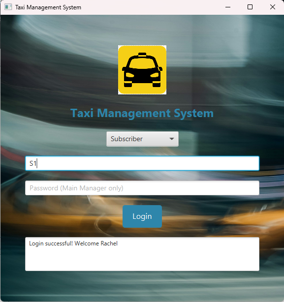
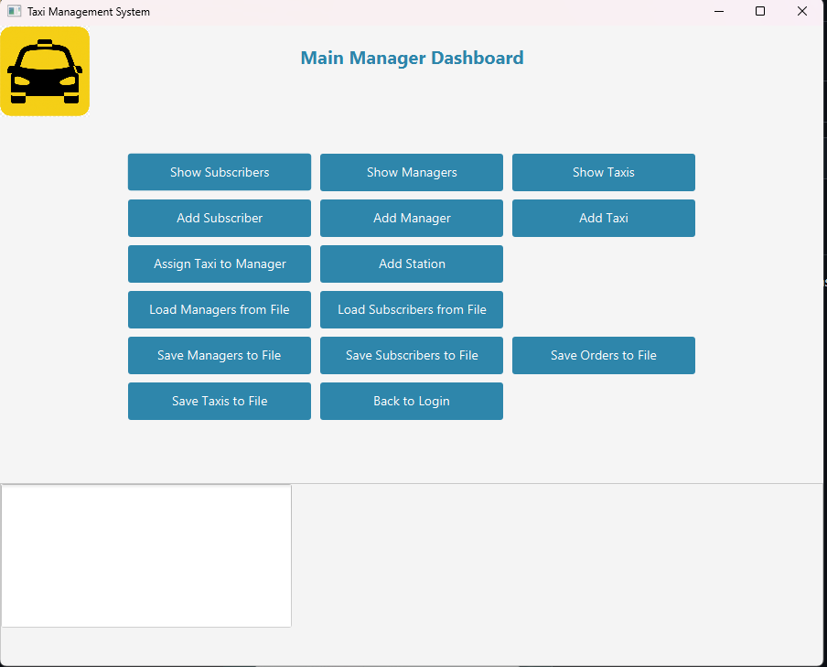
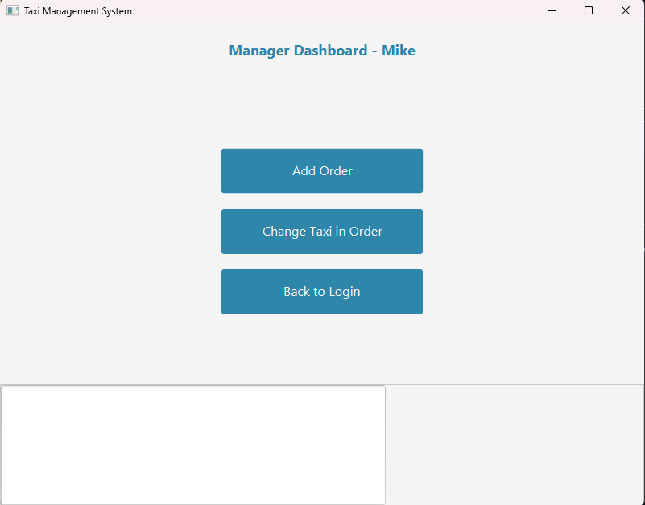
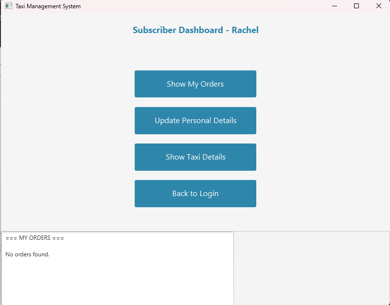
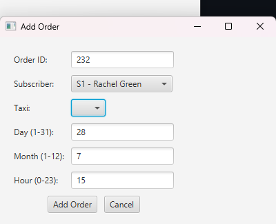
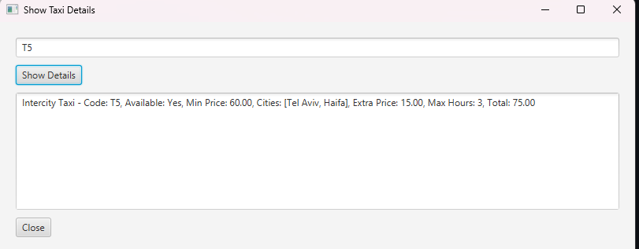

# Taxi Dispatch System

A desktop taxi dispatch and fleet management application built with **Java 21 + JavaFX**, using an
object-oriented domain model with role-based access for three different user types.

Written as a university OOP project (University of Haifa, B.Sc. Computer Science).

<p align="center">
  
</p>

---

## Screenshots

The role chosen at login determines which dashboard is built and what the user can reach.

**Main Manager** — full system access: manage subscribers, managers, taxis and stations, assign
taxis to managers, and persist any collection to file.

<p align="center">
  
</p>

The other two roles get a deliberately narrower surface — a manager dispatches rides, a subscriber
only ever sees their own:

| Manager | Subscriber |
| --- | --- |
|  |  |

Placing an order, and inspecting a taxi. The lookup on the right is where the polymorphism shows
up — `T5` is an `IntercityTaxi`, so it reports its served cities and hour cap alongside the
computed total, fields the regular and express types don't have:

| Add Order | Taxi lookup |
| --- | --- |
|  |  |

---

## Overview

The system models a taxi company: managers register taxis and stations, subscribers place ride
orders, and the application matches orders against the available fleet while enforcing the rules
specific to each taxi type.

Three roles are supported, each with its own set of permissions and its own UI flow:

| Role | Capabilities |
| --- | --- |
| **Subscriber** | Place orders, view personal order history and assigned taxis |
| **Manager** | Manage the taxis and stations under their responsibility |
| **Main Manager** | Full system access — manage all managers, taxis, stations and subscribers |

## Domain model

The class hierarchy is built around two inheritance trees, with polymorphic pricing behaviour
across the taxi types.

```
Person (abstract)
├── Manager
│   └── MainManager
└── Subscription

Taxi
├── ExpressTaxi      (city taxi, fixed surcharge on top of base price)
└── IntercityTaxi    (restricted to a set of served cities, capped trip duration)
```

Supporting types:

- `Order` — a single ride request, linking a subscriber to a taxi and a station
- `Station` — a pickup point with its own taxi roster
- `systemDataBase` — the in-memory data layer

## Storage

All state lives in memory in `systemDataBase`, which holds `ArrayList` collections for the primary
entities plus two `HashMap` indexes for the many-to-one lookups that happen on every screen:

```java
HashMap<String, ArrayList<Order>> ordersPerSub;   // subscriber code -> that subscriber's orders
HashMap<String, ArrayList<Taxi>>  taxisPerSub;    // subscriber code -> taxis assigned to them
```

The maps keep per-subscriber lookups O(1) rather than scanning the full order list on each refresh.

Seed and report data is read from / written to plain text files in the project root
(`members.txt`, `SystemManagers.txt`, `Taxi.txt`). The sample data uses fictional characters.

## Project layout

```
src/HW3/          domain classes and the JavaFX application entry point
src/module-info.java
resources/        stylesheet and images (loaded on the classpath)
*.txt             seed / exported data
```

`TaxiManagementApp` is the JavaFX `Application` entry point and hosts the full UI
(~1,400 lines of scene construction and event handling); the remaining ~1,400 lines are the
domain model.

## Running it

**Requirements:** JDK 21 (developed against Liberica JDK 21 Full) and JavaFX.

The project is set up as an Eclipse project — `.classpath` and `.project` are included, so it can be
imported directly via *File → Import → Existing Projects into Workspace*. It uses the JavaFX
container from the [e(fx)clipse](https://www.eclipse.org/efxclipse/) plugin.

`resources/` is registered as a source folder so the stylesheet and images resolve on the classpath
at runtime.

From the command line, with a JavaFX SDK available:

```bash
javac --module-path $PATH_TO_FX/lib --add-modules javafx.controls,javafx.graphics \
      -d bin $(find src -name "*.java")

java  --module-path $PATH_TO_FX/lib --add-modules javafx.controls,javafx.graphics \
      -cp bin:resources HW3.TaxiManagementApp
```

## Tech

Java 21 · JavaFX (controls, graphics) · Java Platform Module System · CSS styling
